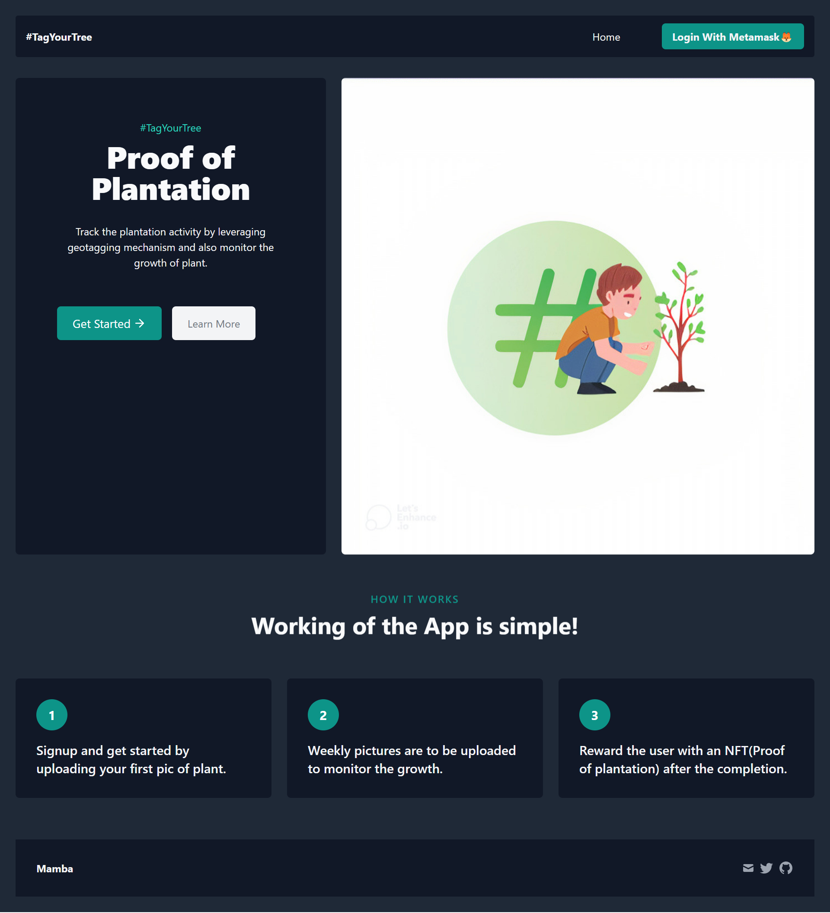
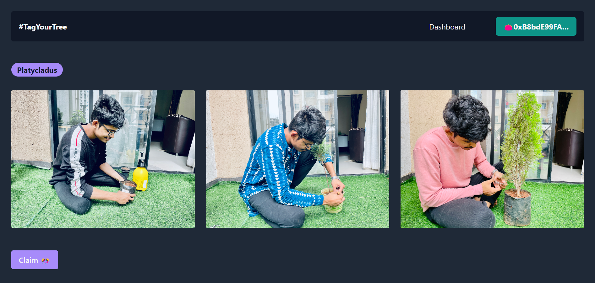

## TagYourTree

We are developing an application to track proof of plantation leveraging geotagging mechanism and also monitoring the growth of plant, with all these data stored on-chain and reward the users with an NFT upon successful completion.

### Clone this repo

```bash
git clone https://github.com/meta-ps/tagyourtree.git
```

### Run

Make sure you have `python` and `Django` install then run

```python
python manage.py makemigrations tagyourtree
python manage.py migrate
python manage.py runserver
```

## UI

### Home Page




### Dashboard




## Tools and Tech Used

- IPFS for image storage.
- Django for server-side.
- HTML/TailwindCSS/JS for frontend.
- Solidity for smart contracts.
- Hardhat for scripts and configuartion.


## Links

- [Pitch Deck](https://www.canva.com/design/DAFGgsGPkY4/HM1Wu9QwMn78XoG5QfhZWg/watch?utm_content=DAFGgsGPkY4&utm_campaign=designshare&utm_medium=link&utm_source=publishsharelink)
- [IPFS code](https://github.com/meta-ps/tagyourtree/blob/master/utility/nftstorage.py)
- [Smart Contract code](https://github.com/meta-ps/tagyourtree/blob/master/NFT.sol)

